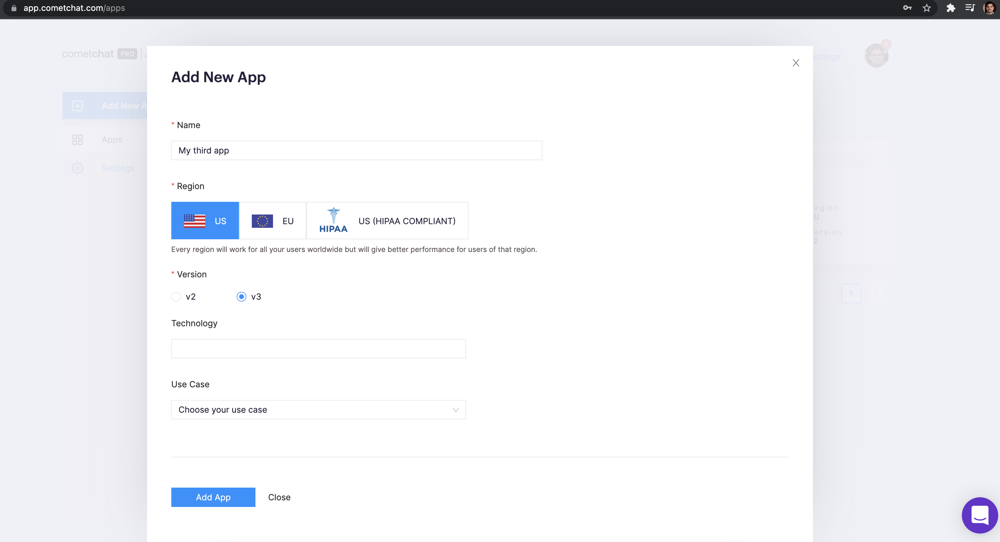
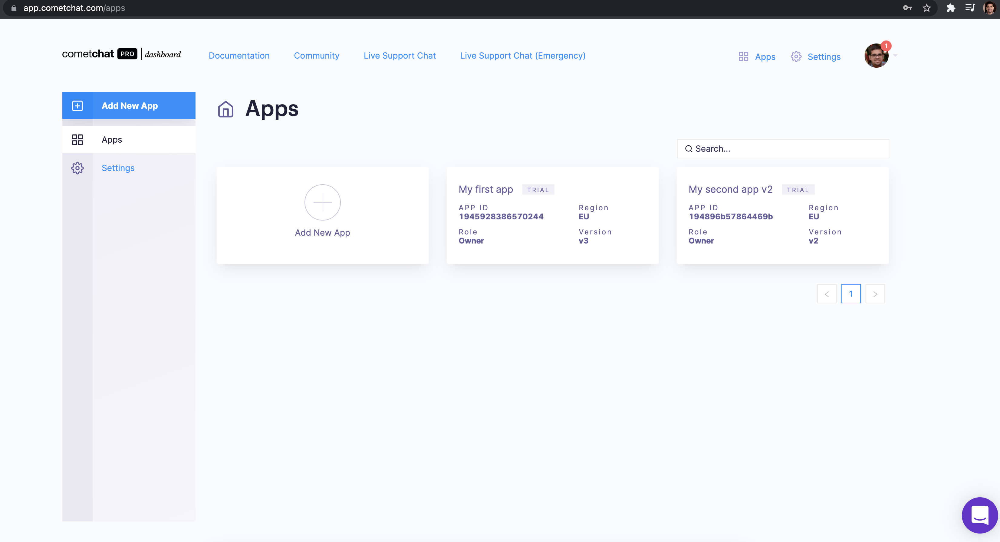
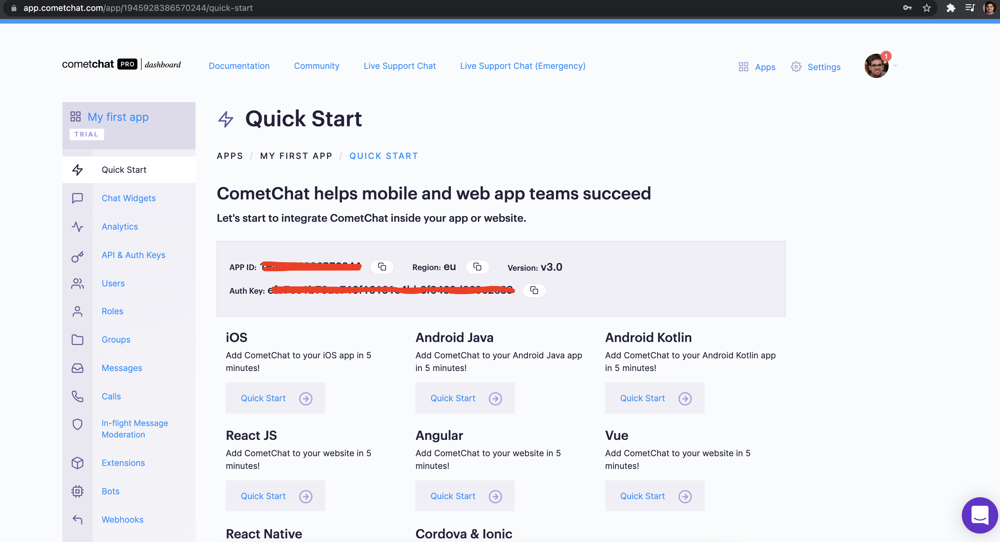

# Overview

Let's build a React Native Chat App to connect with Users & Groups, make Audio & Video Calls, send Text, Media Messages, and more.


To simplify the process and have a production-ready solution in a few minutes, we will use [CometChat React Native UI Kit](https://www.cometchat.com/docs/react-native-chat-ui-kit/overview).

## Prerequisites

Before you begin, ensure you have met the following requirements:

1. A text editor. (e.g., Visual Studio Code, Notepad++, Sublime Text, Atom, or VIM)
2. React Native environment setup either iOS/Android.

## CometChat

I have to admit that one of my always wanted to build projects was a Chat App with Video Calls using React Native, and thanks to CometChat, that dream is now a reality, and you will fulfill the same today by following the steps of this guide.

We all know the difficulties of building an MVP or integrate Video Calls/Chat into an existing React Native project. There're a lot of things to take into consideration, especially when using Video Calls. Thanks to CometChat UI Kit, we can build such functionalities in a matter of minutes.

## Setup

First, you need to register on CometChat. Click [here](https://app.cometchat.com/signup) to Sign Up. Then you can create a New App based on your location. You can also choose CometChat API v2 or the most recent one, which is v3. For this guide, we will choose v3.



Once you create your new CometChat app, you will see the list of apps with essential information like **APP ID**, **Region**, and **Version**. We will use that information later when we initialize our React Native app with CometChat SDK.



Click on the recently created app to see more information.



### Create your React Native App

Open your terminal, and using npx, let's create our React Native Chat App. For this post, we will use React Native v0.66 I strongly recommend you use the same version to avoid compatibility issues with the libraries we will use.

```js
npx react-native init chatApp --version 0.66.0
```

Now, open chatApp using your favourite IDE/Text Editor, I will choose Visual Studio Code and also let's create a **src** folder in the root of our app. Move the file App.js from the root into src folder, remember to update the root index.js to reflect the location change of App.js

**./src/App.js**

```js
import React from 'react';
import {SafeAreaView, StatusBar, StyleSheet, Text, View} from 'react-native';

const App = () => {
  return (
    <SafeAreaView style={styles.container}>
      <StatusBar barStyle="dark-content" />
      <View style={styles.body}>
        <Text>Chat App</Text>
      </View>
    </SafeAreaView>
  );
};

const styles = StyleSheet.create({
  container: {
    flex: 1,
    backgroundColor: '#fff',
  },
  body: {
    paddingHorizontal: 10,
  },
});

export default App;
```

**./index.js**

```js
import {AppRegistry} from 'react-native';
import App from './src/App'; 👈
import {name as appName} from './app.json';

AppRegistry.registerComponent(appName, () => App);
```
