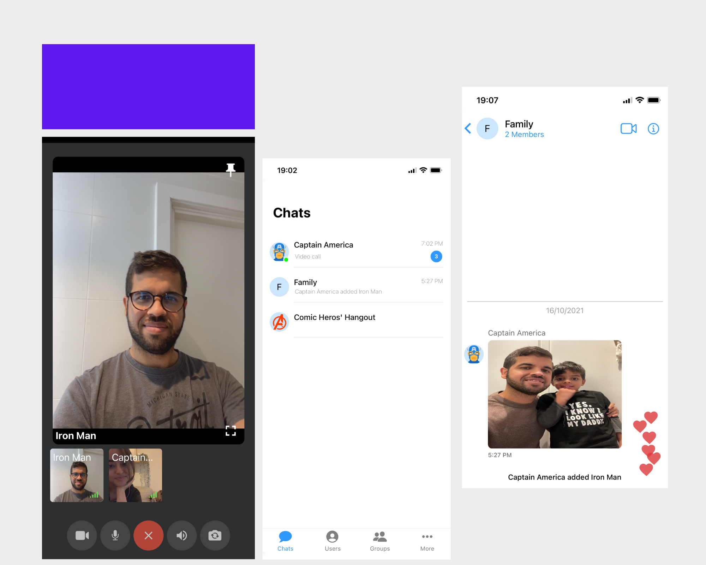

# Overview

Let's build a React Native Chat App to connect with Users & Groups, make Audio & Video Calls, send Text, Media Messages, and more.



To simplify the process and have a production-ready solution in a few minutes, we will use [CometChat React Native UI Kit](https://www.cometchat.com/docs/react-native-chat-ui-kit/overview).

## Prerequisites

Before you begin, ensure you have met the following requirements:

1. A text editor. (e.g., Visual Studio Code, Notepad++, Sublime Text, Atom, or VIM)
2. React Native environment setup either iOS/Android.

## CometChat

I have to admit that one of my always wanted to build projects was a Chat App with Video Calls using React Native, and thanks to CometChat, that dream is now a reality, and you will fulfill the same today by following the steps of this guide.

We all know the difficulties of building an MVP or integrate Video Calls/Chat into an existing React Native project. There're a lot of things to take into consideration, especially when using Video Calls. Thanks to CometChat UI Kit, we can build such functionalities in a matter of minutes.

## Setup

First, you need to register on CometChat. Click [here](https://app.cometchat.com/signup) to Sign Up. Then you can create a New App based on your location. You can also choose CometChat API v2 or the most recent one, which is v3. For this guide, we will choose v3.


Once you create your new CometChat app, you will see the list of apps with essential information like **APP ID**, **Region**, and **Version**. We will use that information later when we initialize our React Native app with CometChat SDK.


Click on the recently created app to see more information.


### Create your React Native App

Open your terminal, and using npx, let's create our React Native Chat App. For this post, we will use React Native v0.66 I strongly recommend you use the same version to avoid compatibility issues with the libraries we will use.

```js
npx react-native init chatApp --version 0.66.0
```

Now, open chatApp using your favourite IDE/Text Editor, I will choose Visual Studio Code and also let's create a **src** folder in the root of our app. Move the file App.js from the root into src folder, remember to update the root index.js to reflect the location change of App.js

**./src/App.js**

```js
import React from 'react';
import {SafeAreaView, StatusBar, StyleSheet, Text, View} from 'react-native';

const App = () => {
  return (
    <SafeAreaView style={styles.container}>
      <StatusBar barStyle="dark-content" />
      <View style={styles.body}>
        <Text>Chat App</Text>
      </View>
    </SafeAreaView>
  );
};

const styles = StyleSheet.create({
  container: {
    flex: 1,
    backgroundColor: '#fff',
  },
  body: {
    paddingHorizontal: 10,
  },
});

export default App;
```

**./index.js**

```js
import {AppRegistry} from 'react-native';
import App from './src/App'; // 👈
import {name as appName} from './app.json';

AppRegistry.registerComponent(appName, () => App);
```

### Add CometChat Dependency

Open your terminal, and let's add CometChat Pro v3 package for React Native.

```js
npm install @cometchat-pro/react-native-chat@3.0.0 --save
```

Also, we need to add React Native Async Storage.

```js
npm install @react-native-async-storage/async-storage
```

#### Setup for iOS

For iOS, we only need to install the dependencies using Cocoa Pods for that you run `npx pod-install` and should be good to go.

#### Setup for Android

Now, for Android, we need to make a couple of adjustments. First, open **android/build.gradle** file, and we will update the buildScript.

```js
buildscript {
    ext {
        buildToolsVersion = "30.0.2"
        minSdkVersion = 24  // 👈 Update the minSdkVersion to 24
        compileSdkVersion = 30
        targetSdkVersion = 30
        ndkVersion = "21.4.7075529"
    }
    ...
}
```

And inside allProjects add maven configuration for cometchat-prop-android.

```js
allprojects {
    repositories {
        ...
        maven {
            url "https://dl.cloudsmith.io/public/cometchat/cometchat-pro-android/maven/"
        }
    }
}
```

### Initialize CometChat inside your app

First, let's create a constants.js file in the root of our app with an object that we will export that contains our CometChat App APP_ID, REGION, and AUTH_KEY. Go into CometChat Dashboard and replace the values with your app settings.

**./constants.js**

```js
export const COMETCHAT_CONSTANTS = {
  APP_ID: 'YOUR_APP_ID',
  REGION: 'YOUR_REGION',
  AUTH_KEY: 'YOUR_AUTH_KEY',
};
```

Now, let's move into our app entrance file generally is recommended to use **./index.js** file.

```js
// Let's import CometChat and the constants created
import {CometChat} from '@cometchat-pro/react-native-chat';
import {COMETCHAT_CONSTANTS} from './constants';

// Setup App Settings and call CometChat init() method.
const appSetting = new CometChat.AppSettingsBuilder()
  .subscribePresenceForAllUsers()
  .setRegion(COMETCHAT_CONSTANTS.REGION)
  .build();
CometChat.init(COMETCHAT_CONSTANTS.APP_ID, appSetting).then(
  () => {
    console.warn('Initialization completed successfully');
    // You can now call warnin function.
  },
  error => {
    console.log('Initialization failed with error:', error);
    // Check the reason for error and take appropriate action.
  },
);
```

Once we finish setting our app and calling the init() method, we can test if everything runs fine. For that, we're going to use Simulators. If you're a Mac user, you can try both iPhone & Android simulators; otherwise, only the Android Simulator will work for you.

Open a terminal and run the Simulator for iOS:

```js
npx react-native run-ios
```

You should see the iPhone Simulator with the console.warn message we used inside the init() method if everything goes well.


For Android run.

```js
npx react-native run-android
```

The result should be the same as the iPhone Simulator.

### Add UI Kit to your project

Next, let's clone CometChat React Native UI Kit repository on our local computer. Open a new terminal window and clone the following repository in another location. In my case, I will clone it in my Desktop folder:

```js
git clone https://github.com/cometchat-pro/cometchat-pro-react-native-ui-kit.git -b v3
```

Once you clone the UI Kit repository, let's create a new folder in the root of our app with the name of **cometchat-pro-react-native-ui-kit** and copy and paste all the folders and files we have inside the cloned repository `cometchat-pro-react-native-ui-kit/src` folder into our just created folder.


#### CometChat UI Kit Dependencies

To make the UI Kit work, we need to install a list of dependencies. And to make the process more petite prom to issues, I will give the list of dependencies that you will establish with the **same version**; otherwise, you probably will have problems.

```
"dependencies": {
    "@cometchat-pro/react-native-calls": "^2.1.1",
    "@cometchat-pro/react-native-chat": "^3.0.0",
    "@react-native-picker/picker": "^1.9.4",
    "@react-navigation/bottom-tabs": "^5.11.2",
    "@react-navigation/native": "^5.8.10",
    "@react-navigation/stack": "^5.12.8",
    "emoji-mart-native": "^0.6.2-beta",
    "react-native-autolink": "^3.0.0",
    "react-native-document-picker": "^4.1.1",
    "react-native-elements": "^3.0.0-alpha.1",
    "react-native-fast-image": "^8.3.4",
    "react-native-gesture-handler": "^1.9.0",
    "react-native-image-picker": "^3.1.1",
    "react-native-keep-awake": "^4.0.0",
    "react-native-reanimated": "^1.13.3",
    "react-native-safe-area-context": "^3.1.9",
    "react-native-screens": "^2.16.1",
    "react-native-sound": "^0.11.0",
    "react-native-swipe-list-view": "^3.2.8",
    "react-native-vector-icons": "^7.1.0",
    "react-native-video": "^5.2.0-alpha1",
    "react-native-video-controls": "^2.7.1",
    "react-native-webview": "^11.14.1",
    "reanimated-bottom-sheet": "^1.0.0-alpha.22",
    "rn-fetch-blob": "^0.12.0",
    "rn-nodeify": "^10.3.0"
  }
```

Now, copy the list from above 👆 and replace it with the dependencies list you have in your **package.json** file in the app's root.

Now, let's remove the `node_modules` & the `package-lock.json` file and install all the dependencies one more time.

```
rm -rf node_modules
rm package-lock.json
npm install
```

Have in mind that some of this libraries needs an extra step in order to finish the installation process for example:

- react-navigation (Android)
- react-native-vector-icons (iOS)

For iOS must of the setup is done by using Cocoa Pods. Let's start there and run `npx pod-install`.

And for Android, let's finish the **react-navigation** setup process, by opeong the file `android/app/src/main/java/com/chatapp/MainActivity.java` and this is mostly because of the react-navigation version we use for this guide wich is v5.X

```js
...
import android.os.Bundle;

public class MainActivity extends ReactActivity {
  ...

  @Override
  protected void onCreate(Bundle savedInstanceState) {
    super.onCreate(null);
  }
}
```

For **react-native-vector-icons** we need to add the list of Fonts into the `Info.plist` file for iOS.

```
<key>UIAppFonts</key>
	<array>
		<string>AntDesign.ttf</string>
		<string>Entypo.ttf</string>
		<string>EvilIcons.ttf</string>
		<string>Feather.ttf</string>
		<string>FontAwesome.ttf</string>
		<string>FontAwesome5_Brands.ttf</string>
		<string>FontAwesome5_Regular.ttf</string>
		<string>FontAwesome5_Solid.ttf</string>
		<string>Foundation.ttf</string>
		<string>Ionicons.ttf</string>
		<string>MaterialIcons.ttf</string>
		<string>MaterialCommunityIcons.ttf</string>
		<string>SimpleLineIcons.ttf</string>
		<string>Octicons.ttf</string>
		<string>Zocial.ttf</string>
		<string>Fontisto.ttf</string>
	</array>
```

Remember that we used specific versions of the libraries, and I recommend you use the identical versions I used. If you still want to try the latest versions, you're free to do it. I hope you won't find too many issues 😉

### Let's add some screens

Create a new folder inside src called `screens,` and inside screens folder, let's create `Login` & `SignUp` folders and inside each folder add an `index.js` file.

Your files & folders should look like this

- `src/screens/Login/index.js`
- `src/screens/SignUp/index.js`

#### User LogIn

Inside `src/screens/Login/index.js` copy & paste next code:

```js
import React from 'react';
import {View} from 'react-native';
import {Input, Button} from 'react-native-elements';
import {styles} from '../../styles';

import {CometChat} from '@cometchat-pro/react-native-chat';
import {COMETCHAT_CONSTANTS} from '../../../constants';

export default function Login({navigation}) {
  const [uid, setUsername] = React.useState('');

  const handleSignIn = async () =>
    CometChat.login(uid, COMETCHAT_CONSTANTS.AUTH_KEY).then(
      user => {
        console.log('User is logged in: ', user);
      },
      error => {
        console.log('error on login: ', error);
      },
    );

  return (
    <View style={styles.container}>
      <View style={styles.body}>
        <Input
          placeholder="username"
          leftIcon={{type: 'font-awesome', name: 'user'}}
          onChangeText={value => setUsername(value)}
        />

        <Button title="Sign In" loading={false} onPress={handleSignIn} />
        <Button
          title="Sign Up"
          type="outline"
          style={styles.mt10}
          onPress={() => navigation.navigate('SignUp')}
        />
      </View>
    </View>
  );
}
```

As you can see, we have created a Login screen with a `username` Input component from react-native-elements. Maybe the most important is that we also imported the `CometChat` class, and we're using the login() method to log in to our app using a username.

We already imported the navigation prop to navigate to the SignUp screen, but for that to work, we need to use the NavigationContainer from react-navigation. Keep reading because we will do that in a bit.

#### Styling

Let's add some styles for our screens; for that, create a `styles` folder and add an `index.js` file.

**./src/styles/index.js**

```js
import {StyleSheet} from 'react-native';

export const globalStyles = StyleSheet.create({
  container: {
    flex: 1,
  },
  header: {
    flex: 2,
    justifyContent: 'center',
    alignItems: 'center',
  },
  body: {
    flex: 3,
    paddingHorizontal: 20,
    paddingVertical: 30,
  },
  title: {
    color: '#000',
    fontWeight: 'bold',
    fontSize: 30,
  },
  mt10: {
    marginTop: 10,
  },
});
```

#### User SignUp

Inside `src/screens/SignUp/index.js` copy & paste next code:

```js
import React from 'react';
import {View} from 'react-native';
import {Input, Button} from 'react-native-elements';
import {styles} from '../../styles';

import {CometChat} from '@cometchat-pro/react-native-chat';
import {COMETCHAT_CONSTANTS} from '../../../constants';
import gravatar from 'gravatar-api';

export default function SignUp() {
  const [data, setData] = React.useState({
    name: '',
    uid: '',
    email: '',
  });

  const handleSignUp = async () => {
    if (data.name !== '' && data.uid !== '') {
      let user = new CometChat.User(data.uid);
      user.setName(data.name);
      user.avatar = gravatar.imageUrl({
        email: data.email,
        parameters: {size: '500'},
        secure: true,
      });

      try {
        const newUser = await CometChat.createUser(
          user,
          COMETCHAT_CONSTANTS.AUTH_KEY,
        );
        console.log('User created: ', newUser);
      } catch (error) {
        console.log('error on createUser: ', error);
      }

      try {
        const loggedUserInfo = await CometChat.login(
          data.uid,
          COMETCHAT_CONSTANTS.AUTH_KEY,
        );
        console.log('User is logged in: ', loggedUserInfo);
      } catch (error) {
        console.log('error on login: ', error);
      }
    }
  };

  return (
    <View style={styles.container}>
      <View style={styles.body}>
        <Input
          placeholder="username"
          leftIcon={{type: 'font-awesome', name: 'user'}}
          onChangeText={value => setData({...data, uid: value})}
        />
        <Input
          placeholder="name"
          leftIcon={{type: 'font-awesome', name: 'user'}}
          onChangeText={value => setData({...data, name: value})}
        />

        <Input
          placeholder="email"
          leftIcon={{type: 'font-awesome', name: 'envelope'}}
          onChangeText={value => setData({...data, email: value})}
        />

        <Button title="Sign Up" loading={false} onPress={handleSignUp} />
      </View>
    </View>
  );
}
```

Same as the Login screen, here we import CometChat class to use the `User()` method to add the user **UID**, **Name**, and **Avatar** image. We use the `gravatar-api` package for the avatar image URL, which will create a Gravatar based on the user email. We need to install it, so run the following command:

```
npm i gravatar-api
```

Once we create a new User object, we can use the method `createUser()` to create the user inside CometChat dashboard. We use try-catch to catch any error we might face. After that, we use the method `login()` to log in the recently created user into CometChat.

### Configure Navigation

We have already installed react-navigation. Let's create Stack navigation to navigate between our two new screens.

Create an `index.js` file inside `screens` folder.

```js
import React from 'react';
import {createStackNavigator} from '@react-navigation/stack';

import SignIn from './Login';
import SignUp from './SignUp';

const Stack = createStackNavigator();

const AuthScreens = () => (
  <Stack.Navigator>
    <Stack.Screen name="SignIn" component={SignIn} />
    <Stack.Screen name="SignUp" component={SignUp} />
  </Stack.Navigator>
);

const Screens = () => {
  return <AuthScreens />;
};

export default Screens;
```

Open our `App.js` file and update the content adding a `NavigationContainer` and importing our `screens/index.js` file to render our screens.

```js
import React from 'react';
import {SafeAreaView, StatusBar} from 'react-native';
import {NavigationContainer} from '@react-navigation/native';
import Screens from './screens';
import {styles} from './styles';

const App = () => {
  return (
    <SafeAreaView style={styles.container}>
      <StatusBar barStyle="dark-content" />
      <NavigationContainer>
        <Screens />
      </NavigationContainer>
    </SafeAreaView>
  );
};

export default App;
```

Let's run what we have now using the Simulator, for iOS use `npx react-native run-ios` & for Android `npx react-native run-android`

**Sign In**


**Sign Up**


### Adding a Demo user

Let's try to SignUp a Demo user, so navigate the SignUp screen and fillup the form. In my case, I added the following user information:

- username: Demo
- name: Demo
- email: my personal email which already have a Gravatar image.

After testing the SingUp screen, you can see the new user information if you Login into [cometchat.com](https://www.cometchat.com/) account and open the Users section of the Dashboard.


